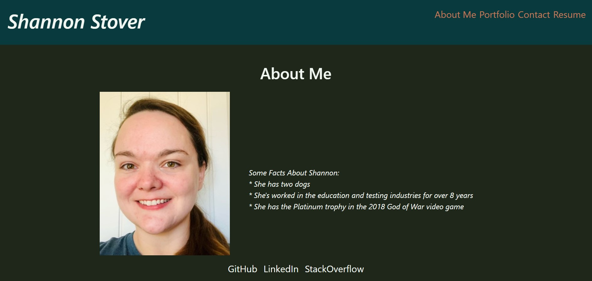

# React Challenge: React Portfolio

## Description

```
This is the latest professional portfolio I've made as a web developer.
This portfolio was made using React, Bootstrap, and CSS. It contains 6
projects that I've developed or assisted in developing.
```

## Acceptance Criteria

```
- It is done when the the portfolio loads and displays a page containing
a header, a section for content, and a footer.

- It is done when the header shows the developer's name and navigation
with titles corresponding to different sections of the portfolio.

- It is done when the navigation titles are About Me, Portfolio, Contact,
and Resume, and the title corresponding to the current section is highlighted.
When the navigation titles are clicked, the corresponding section below the
navigation is rendered without the page reloading and that title is highlighted.

- It is done when the portfolio displays by default the About Me title and
section.

- It is done when the About Me section contains a recent photo or avatar of
the developer and a short bio about them.

- It is done when the Portfolio section displays titled images of six of the
 developer’s applications with links to both the deployed applications and the
 corresponding GitHub repository.

- It is done when the Contact section displays a contact form with fields for a
 name, an email address, and a message. If the cursor is moved out of one of the
  form fields without entering text, a notification appears stating that this
  field is required. If incorrectly formatted text is entered into the email
  address field, a notification appears stating that this is an invalid email
  address.

- It is done when the Resume section displays a link to a downloadable resume
and a list of the developer’s proficiencies.

- It is done when the footer displays text or icon links to the developer’s
GitHub and LinkedIn profiles, and their profile on a third platform (Stack
Overflow, Twitter).

```

The following image demonstrates the application functionality:



## Review

You are required to submit the following for review:

- The URL of the functional, deployed application: https://sstover25.github.io/react_portfolio/
- The URL of the GitHub repository: https://github.com/sstover25/react_portfolio

---

## Installation

```
To use this application, you must have the following dependencies installed:
- React
- Bootstrap
```

## Credits

```
Coding assistance from KU bootcamp modules, the TA office hours, MDN,
Bootstrap documentation, and Stack Overflow.
```
